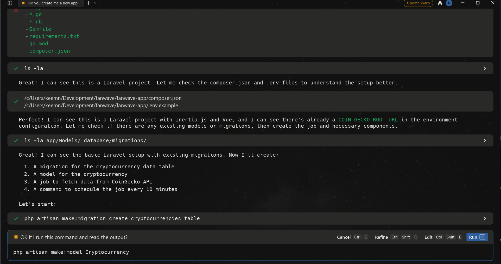

# Fanwave Digital Tech Assesment
Thanks for checking out my technical assessment.  It's been a fun challenge getting stuck into this work - especially after a couple of months without touching a line of code! 

I've decided to implement this task in the following way.

Create a Job in Laravel to populate the DB with coin data from Coin Gecko - this API can be accessed from the Nuxt app directly without the need for Laravel but for this task i'm adding this storage step to allow for future transformation of the data.

This will also reduce the amount of calls to the Coin Gecko API and allow more control over a users access and offer more features in the future, for example, I can imagine a user wanting to save a list of favourite coins and i would implement the user login and profile storage in Laravel

## Local Environment
I'm developing on my windows laptop using WSL2 to give me a more familiar dev environment and set of tools - i've pretty much only ever used linux or MacOS for development work so there have been some interesting challenges getting the usual stack running under this setup.  I'm using an Ubuntu box and running laravel in Docker via laravel sail.  The nuxt front end is running under it's own local server.  With a bit more time i'd like to have set up docker compose to run nuxt in it's own container so i could spin everything up with one command.

## Version Control
I'm using a typical feature branch stategy in git to keep track of changes.  main will be my production like branch and features are merged in as and when they are built for ease of control over the state of the app.  I've put the front end and backend code in the same monorepo for ease of sharing.  I would probably have seperate repos for this in a real world project.

## AI Integration
I'm using Warp terminal which has an OpenAI integration allowing for tight integration between AI and my code.  I can ask the AI to scaffold my code for quick development and reduction of time writing boilerplate code.

For example, I asked it to create a landing page with the top 10 crypto currencies using dummy data in my nuxt app and it created the basic page for me.


Next i moved to laravel and told the AI to scaffold me a job to poll the Coin Gecko '/coins/markets' endpoint every 10 minutes and to save that data for me.  At this point I had only added my API key to the services.php config file.  

Warp analysed my codebase and created the Job, Models, Migrations, Documentation, Console command and route.  It then tested the set up.  I had to intervene once or twice to let it know I was using laravel sail and to not use SQLite but other than that it did a great job.  

Creating all this by hand is very tedious and error prone, by getting Warp terminal to set this up i can focus on getting the work done and not waste time on boilerplate code like this.



I also used this functionality throughout the build to save time and simplify debugging - I can simply type "the search functionality is hanging" and Warp will debug and suggest fixes for me.  Another good usage was to ask it to replace the initial css styles with tailwind as i somehow missed that requirement when starting the code.

It also generated some documentation for me regarding the API and the scheduled task.  This is in the server repo and provides instructions on how to run the job.

Finally I got Warp to write me a comprehensive batch of feature and unit tests - normally i would choose what tests to create by hand but due to time constraints i generated them this way.

## How to run
#### **Real Cryptocurrency Data:**
- ✅ **Live prices** from CoinGecko
- ✅ **Real logos** with fallback symbols
- ✅ **Market cap rankings**
- ✅ **24h price changes** (green/red)
- ✅ **Trading volumes**
- ✅ **Last updated timestamps**

#### **User Experience:**
- ✅ **Loading spinner** during data fetch
- ✅ **Error messages** with retry buttons
- ✅ **Responsive grid** layout
- ✅ **Smooth animations** and transitions
- ✅ **Mobile-friendly** design

### 📱 How to Test:

1. **Start the Laravel backend:**
   ```bash
   cd fanwave-app
   ./vendor/bin/sail up -d
   ```
   ```bash
   ./vendor/bin/sail artisan migrate
   ```
   if you encounter any errors here you may need to also run
   ```bash
   ./vendor/bin/sail composer install
   ./vendor/bin/sail composer run dev
   ```

2. **Start the Nuxt frontend:**
   ```bash
   cd fanwave-app-frontend
   npm install
   npm run dev
   ```

3. **Run the Job:**
   
   Make sure your .env file contains
   ```
      COIN_GECKO_API_KEY="your-api-key-here"
      COIN_GECKO_ROOT_URL="https://api.coingecko.com/api/v3/"
      ```
   ```bash
   cd fanwave-app
   ./vendor/bin/sail artisan crypto:fetch --sync
   ```
   or
   ```bash
   cd fanwave-app
   ./vendor/bin/sail artisan queue:work
   ```

4. **Visit the pages:**
   - Landing page: `http://localhost:3000/`
   - Crypto data: `http://localhost:3000/crypto`

5. **Run tests:**
   ```bash
   cd fanwave-app
   ./vendor/bin/sail artisan test
   ```

### 🔧 Technical Stack:

#### **Frontend:**
- **Nuxt 3** with TypeScript
- **Vue 3** Composition API
- **Reactive data** with ref()
- **Composables** for API calls
- **CSS Grid** for responsive layout

#### **Backend:**
- **Laravel 12** with Sail
- **RESTful API** endpoints
- **MySQL database** with real CoinGecko data
- **Scheduled jobs** (every 10 minutes)
- **Error handling** and logging

### 🎯 What You Can Do Now:

#### **View Real Data:**
- See actual Bitcoin, Ethereum, and other crypto prices
- Real market cap rankings from CoinGecko
- Live 24-hour price changes
- Current trading volumes

#### **Test Features:**
- Refresh functionality
- Error recovery
- Mobile responsiveness
- Loading states

#### **API Testing:**
```bash
# Test the API directly
curl "http://localhost/api/crypto/top?limit=5"

# Test individual crypto
curl "http://localhost/api/crypto/bitcoin"

# Test search
curl "http://localhost/api/cryptocurrencies/search?query=eth"
```

## Test Results
docker exec fanwave-app-laravel.test-1 php artisan test

   PASS  Tests\Unit\ExampleTest
  ✓ that true is true                                                    5.08s  

   PASS  Tests\Unit\Models\CryptocurrencyTest
  ✓ it can create a cryptocurrency                                       0.34s  
  ✓ it casts numeric fields correctly                                    0.16s  
  ✓ it casts datetime fields correctly                                   0.14s  
  ✓ it can scope top by market cap                                       0.17s  
  ✓ it has formatted price attribute                                     0.14s  
  ✓ it has formatted market cap attribute                                0.14s  
  ✓ it handles null market cap in formatting                             0.13s  
  ✓ it can be mass assigned                                              0.14s  
  ✓ it excludes cryptocurrencies without market cap rank from top scope  0.13s  

   PASS  Tests\Feature\Api\CryptocurrencyApiTest
  ✓ it can get top cryptocurrencies                                      1.12s  
  ✓ it can get top cryptocurrencies with custom limit                    0.15s  
  ✓ it validates limit parameter for top cryptocurrencies                0.19s  
  ✓ it can get specific cryptocurrency by id                             0.14s  
  ✓ it returns 404 for non existent cryptocurrency                       0.14s  
  ✓ it can search cryptocurrencies by name                               0.14s  
  ✓ it can search cryptocurrencies by symbol                             0.14s  
  ✓ it validates search query parameter                                  0.17s  
  ✓ it can get cryptocurrency statistics                                 0.14s  
  ✓ it can get cryptocurrencies index                                    0.14s  
  ✓ it handles empty search results                                      0.14s  
  ✓ it returns correct data types                                        0.16s  
  ✓ it formats prices correctly                                          0.15s  

   PASS  Tests\Feature\Auth\AuthenticationTest
  ✓ login screen can be rendered                                         0.75s  
  ✓ users can authenticate using the login screen                        0.48s  
  ✓ users can not authenticate with invalid password                     0.40s  
  ✓ users can logout                                                     0.15s  

   PASS  Tests\Feature\Auth\EmailVerificationTest
  ✓ email verification screen can be rendered                            0.18s  
  ✓ email can be verified                                                0.20s  
  ✓ email is not verified with invalid hash                              0.24s  

   PASS  Tests\Feature\Auth\PasswordConfirmationTest
  ✓ confirm password screen can be rendered                              0.18s  
  ✓ password can be confirmed                                            0.15s  
  ✓ password is not confirmed with invalid password                      0.35s  

   PASS  Tests\Feature\Auth\PasswordResetTest
  ✓ reset password link screen can be rendered                           0.16s  
  ✓ reset password link can be requested                                 0.50s  
  ✓ reset password screen can be rendered                                0.38s  
  ✓ password can be reset with valid token                               0.43s  

   PASS  Tests\Feature\Auth\RegistrationTest
  ✓ registration screen can be rendered                                  0.16s  
  ✓ new users can register                                               0.16s  

   PASS  Tests\Feature\DashboardTest
  ✓ guests are redirected to the login page                              0.15s  
  ✓ authenticated users can visit the dashboard                          0.17s  

   PASS  Tests\Feature\ExampleTest
  ✓ returns a successful response                                        0.16s  

   PASS  Tests\Feature\Settings\PasswordUpdateTest
  ✓ password can be updated                                              0.15s  
  ✓ correct password must be provided to update password                 0.16s  

   PASS  Tests\Feature\Settings\ProfileUpdateTest
  ✓ profile page is displayed                                            0.19s  
  ✓ profile information can be updated                                   0.17s  
  ✓ email verification status is unchanged when the email address is un… 0.14s  
  ✓ user can delete their account                                        0.14s  
  ✓ correct password must be provided to delete account                  0.15s  

  Tests:    49 passed (304 assertions)
  Duration: 17.34s

