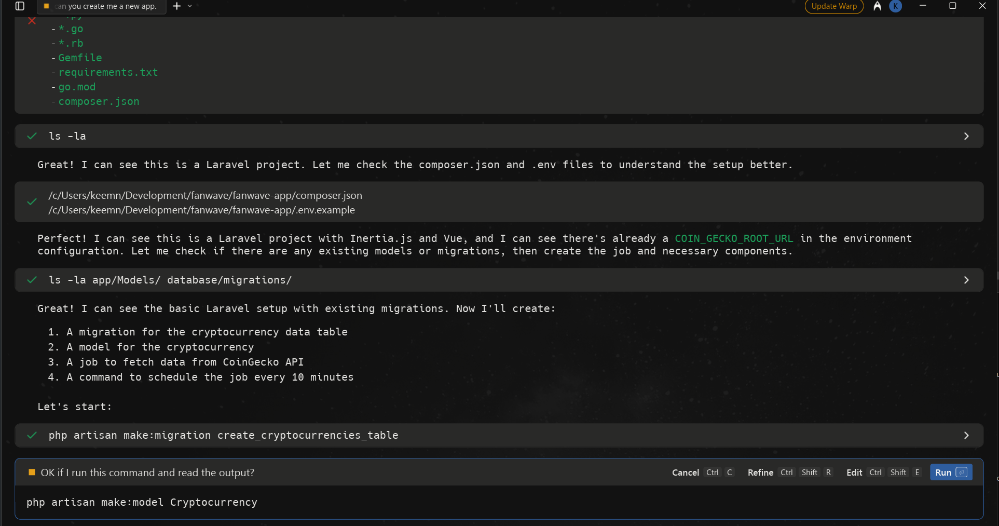

# Fanwave Digital Tech Assesment
Thanks for checking out my technical assessment.  It's been a fun challenge getting stuck into this work - especially after a couple of months without touching a line of code! 

## Local Environment
I'm developing on my windows laptop using WSL2 to give me a more familiar dev environment and set of tools - i've pretty much only ever used linux or MacOS for development work so there have been some interesting challenges getting the usual stack running under this setup.  I'm using an Ubuntu box and running laravel in Docker via laravel sail.  The nuxt front end is running under it's own local server.  With a bit more time i'd like to have set up docker compose to run nuxt in it's own container so i could spin everything up with one command.

## Version Control
I'm using a typical feature branch stategy in git to keep track of changes.  main will be my production like branch and features are merged in as and when they are built for ease of control over the state of the app.  I've put the front end and backend code in the same monorepo for ease of sharing.  I would probably have seperate repos for this in a real world project.

## AI Integration
I'm using Warp terminal which has an OpenAI integration allowing for tight integration between AI and my code.  I can ask the AI to scaffold my codeeeeeee for quick development and reduction of time writing boilerplate code.

For example, I asked it to create a landing page with the top 10 crypto currencies using dummy data in my nuxt app and it created the basic page for me.

Next i moved to laravel and told the AI to scaffold me a job to poll the Coin Gecko '/coins/markets' endpoint every 10 minutes and to save that data for me.  At this point I had only added my API key to the services.php config file.  

Warp analysed my codebase and created the Job, Models, Migrations, Documentation, Console command and route.  It then tested the set up.  I had to intervene once or twice to let it know I was using laravel sail and to not use SQLite but other than that it did a great job.  

Creating all this by hand is very tedious and error prone, by getting Warp terminal to set this up i can focus on getting the work done and not waste time on boilerplate code like this.

## Search